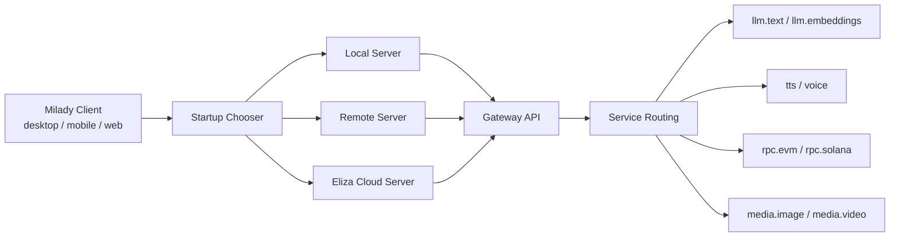

Milady’s architecture should be understood in four layers:

1. **Client**
2. **Server target**
3. **Gateway API**
4. **Capability routing**

For CLI-based installs, this architecture ships through the `miladyai` npm package.

## The Core Rule

`local`, `remote`, and `cloud-managed` describe **where the server runs**.

They do **not** decide the model provider.

Provider routing belongs to the selected server and should be expressed independently for each capability. The canonical model the repo is moving toward is:

- `deploymentTarget`
- `linkedAccounts`
- `serviceRouting`

## Config Ownership

The intended ownership split is:

- bootstrap config file for local server startup
- client-side startup state for the selected server
- server database for mutable routing and settings
- secure storage for secrets and credentials

Today the repo still contains compatibility layers and older config paths. Those are intentionally documented in [Current Transitional Seams](/reference/transitional-seams) instead of hidden.

## Why This Matters

This architecture prevents the bugs that were happening before:

- logging into Eliza Cloud should not silently force Eliza Cloud inference
- switching runtime target should not overwrite the chosen model provider
- onboarding should not be the only place that can author long-lived routing
- local, cloud, and remote should all behave the same from the client’s perspective
