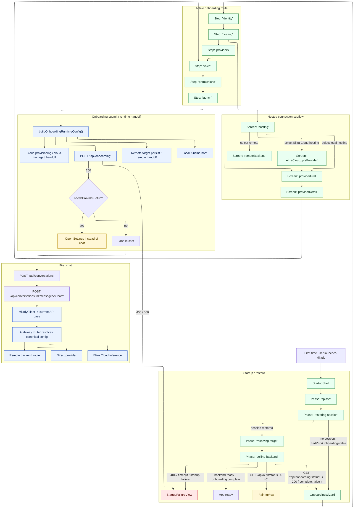
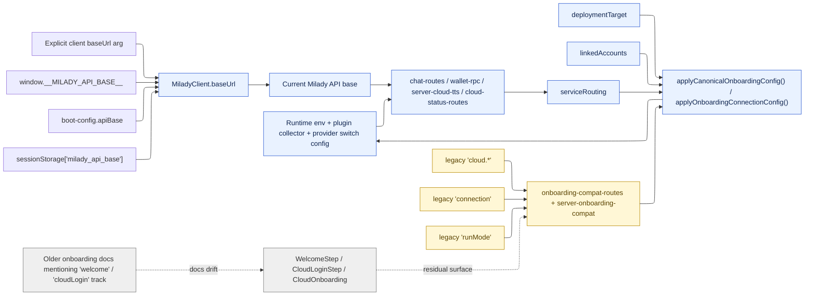

# Onboarding to chat: complete surface map

This document maps the **actual first-run user experience** from app launch to the first chat send, using the codebase as the source of truth.

It is intentionally broader than a UI walkthrough:

- It includes the **user-visible screens**.
- It includes the **state fields and variables** that drive those screens.
- It includes the **gateway/router path** from the renderer to the active backend.
- It includes the **HTTP statuses and control branches** that decide what the user sees.
- It calls out **residual or compatibility surfaces** that still exist in the tree and can create drift, confusion, or race conditions.

## Scope

This map covers:

1. App launch and startup routing
2. Session restore and target resolution
3. Pairing and onboarding gating
4. Onboarding steps and nested connection flow
5. Onboarding submission and runtime handoff
6. Transition into chat
7. First chat send through the gateway/router

It does **not** attempt to fully map later settings pages, plugin registry, knowledge upload, or post-chat workflows.

## Source of truth

### Startup and shell

- [`packages/app-core/src/components/shell/StartupShell.tsx`](../../packages/app-core/src/components/shell/StartupShell.tsx)
- [`packages/app-core/src/state/useStartupCoordinator.ts`](../../packages/app-core/src/state/useStartupCoordinator.ts)
- [`packages/app-core/src/state/startup-coordinator.ts`](../../packages/app-core/src/state/startup-coordinator.ts)
- [`packages/app-core/src/state/startup-phase-restore.ts`](../../packages/app-core/src/state/startup-phase-restore.ts)
- [`packages/app-core/src/state/onboarding-resume.ts`](../../packages/app-core/src/state/onboarding-resume.ts)

### Onboarding wizard and state

- [`packages/app-core/src/components/onboarding/OnboardingWizard.tsx`](../../packages/app-core/src/components/onboarding/OnboardingWizard.tsx)
- [`packages/app-core/src/onboarding/flow.ts`](../../packages/app-core/src/onboarding/flow.ts)
- [`packages/app-core/src/state/useOnboardingState.ts`](../../packages/app-core/src/state/useOnboardingState.ts)
- [`packages/app-core/src/state/types.ts`](../../packages/app-core/src/state/types.ts)

### Connection subflow

- [`packages/app-core/src/onboarding/connection-flow.ts`](../../packages/app-core/src/onboarding/connection-flow.ts)
- [`packages/app-core/src/onboarding/types.ts`](../../packages/app-core/src/onboarding/types.ts)
- [`packages/app-core/src/components/onboarding/ConnectionStep.tsx`](../../packages/app-core/src/components/onboarding/ConnectionStep.tsx)
- [`packages/app-core/src/components/onboarding/connection/README.md`](../../packages/app-core/src/components/onboarding/connection/README.md)
- [`packages/app-core/src/components/onboarding/connection/ConnectionHostingScreen.tsx`](../../packages/app-core/src/components/onboarding/connection/ConnectionHostingScreen.tsx)
- [`packages/app-core/src/components/onboarding/connection/ConnectionRemoteBackendScreen.tsx`](../../packages/app-core/src/components/onboarding/connection/ConnectionRemoteBackendScreen.tsx)
- [`packages/app-core/src/components/onboarding/connection/ConnectionProviderGridScreen.tsx`](../../packages/app-core/src/components/onboarding/connection/ConnectionProviderGridScreen.tsx)
- [`packages/app-core/src/components/onboarding/connection/ConnectionProviderDetailScreen.tsx`](../../packages/app-core/src/components/onboarding/connection/ConnectionProviderDetailScreen.tsx)
- [`packages/app-core/src/components/onboarding/connection/ConnectionElizaCloudPreProviderScreen.tsx`](../../packages/app-core/src/components/onboarding/connection/ConnectionElizaCloudPreProviderScreen.tsx)

### Onboarding submission and canonical config

- [`packages/app-core/src/onboarding-config.ts`](../../packages/app-core/src/onboarding-config.ts)
- [`packages/app-core/src/state/useOnboardingCallbacks.ts`](../../packages/app-core/src/state/useOnboardingCallbacks.ts)
- [`packages/shared/src/contracts/onboarding.ts`](../../packages/shared/src/contracts/onboarding.ts)
- [`packages/shared/src/contracts/service-routing.ts`](../../packages/shared/src/contracts/service-routing.ts)
- [`packages/agent/src/api/provider-switch-config.ts`](../../packages/agent/src/api/provider-switch-config.ts)
- [`packages/agent/src/api/onboarding-routes.ts`](../../packages/agent/src/api/onboarding-routes.ts)
- [`packages/app-core/src/api/onboarding-compat-routes.ts`](../../packages/app-core/src/api/onboarding-compat-routes.ts)
- [`packages/app-core/src/api/server-onboarding-compat.ts`](../../packages/app-core/src/api/server-onboarding-compat.ts)

### Client gateway and first chat

- [`packages/app-core/src/api/client-base.ts`](../../packages/app-core/src/api/client-base.ts)
- [`packages/app-core/src/api/client-agent.ts`](../../packages/app-core/src/api/client-agent.ts)
- [`packages/app-core/src/api/client-chat.ts`](../../packages/app-core/src/api/client-chat.ts)
- [`packages/app-core/src/state/useChatSend.ts`](../../packages/app-core/src/state/useChatSend.ts)
- [`packages/agent/src/api/chat-routes.ts`](../../packages/agent/src/api/chat-routes.ts)
- [`packages/agent/src/api/provider-switch-routes.ts`](../../packages/agent/src/api/provider-switch-routes.ts)
- [`packages/agent/src/api/cloud-status-routes.ts`](../../packages/agent/src/api/cloud-status-routes.ts)

## Core invariant

The correct architecture is:

- The renderer talks to **one current Milady API base** through [`MiladyClient`](../../packages/app-core/src/api/client-base.ts).
- That backend is the **gateway/router** for the session, regardless of whether the runtime is local, cloud, or remote.
- The backend resolves actual behavior from three canonical persisted objects:
  - `deploymentTarget`
  - `linkedAccounts`
  - `serviceRouting`

Those mean different things:

| Concern | Canonical source | Meaning |
|---|---|---|
| Where the app/runtime lives | `deploymentTarget` | `local`, `cloud`, or `remote` |
| Which accounts are linked | `linkedAccounts` | Eliza Cloud, OpenAI subscription, Anthropic subscription, API-key-backed services, and so on |
| Which backend handles a capability | `serviceRouting` | `llmText`, `tts`, `media`, `embeddings`, `rpc` |

This is the key product invariant:

- A user can run on a **local**, **cloud**, or **remote** runtime.
- The same user can still choose **Eliza Cloud**, **OpenAI**, **Anthropic**, **OpenRouter**, **Ollama**, **Pi AI**, and other supported providers for inference.
- Runtime location and model provider are **not** the same concept.

## Legend

- Green = live happy path
- Blue = canonical routing or source of truth
- Yellow = compatibility or migration path
- Red = failure or conflict surface
- Gray = residual or dormant surface still present in the tree

## Diagram 1: launch to first chat

## Diagram 2: authority map and conflict surfaces

## Live first-run route, step by step

### 1. Launch and splash

Live entry point:

- [`StartupShell.tsx`](../../packages/app-core/src/components/shell/StartupShell.tsx)

What the user sees:

- A splash/progress shell while startup is still unresolved
- A `Press Start` affordance only when the startup phase is literally `splash`

What decides the next screen:

- [`startupCoordinator.phase`](../../packages/app-core/src/state/startup-coordinator.ts)

Important phase outputs:

| Phase | What it means | Next visible surface |
|---|---|---|
| `splash` | App is waiting for user acknowledgment or startup continuation | Splash |
| `restoring-session` | Restore previously selected API base / token / mode | Splash |
| `resolving-target` | A target was restored and is being resolved | Splash |
| `polling-backend` | The restored backend is being probed | Splash |
| `pairing-required` | Auth is required before continuing | Pairing UI |
| `onboarding-required` | Backend is available but setup is incomplete, or no session exists | Onboarding wizard |
| `starting-runtime` | Local runtime is starting | Splash |
| `hydrating` | App state is being hydrated after target resolution | Splash |
| `ready` | Normal app shell can mount | Chat or prior tab |
| `error` | Startup hit a terminal condition | Failure UI |

### 2. Session restore and target resolution

Source of truth:

- [`startup-phase-restore.ts`](../../packages/app-core/src/state/startup-phase-restore.ts)
- [`onboarding-resume.ts`](../../packages/app-core/src/state/onboarding-resume.ts)
- [`client-base.ts`](../../packages/app-core/src/api/client-base.ts)

Restore precedence for the renderer API base:

1. Explicit client constructor argument
2. `window.__MILADY_API_BASE__`
3. Boot config `apiBase`
4. `sessionStorage["milady_api_base"]`
5. Same-origin empty-base fallback

Implication:

- The renderer always talks to the **currently selected gateway backend**.
- The renderer does **not** talk directly to “OpenAI”, “Anthropic”, or “Eliza Cloud inference” on its own.
- Provider-specific routing happens behind the gateway/backend.

Restore branch outcomes:

| Condition | Result |
|---|---|
| No restored session and no prior onboarding | `NO_SESSION` -> onboarding-required |
| No restored session but prior onboarding existed | terminal startup error |
| Restored target is local | local backend is prepared and polled |
| Restored target is cloud-managed | cloud target is prepared and polled |
| Restored target is remote | remote API base and token are restored and polled |

### 3. Pairing and onboarding gate checks

Primary API calls:

- `GET /api/auth/status`
- `GET /api/onboarding/status`

Client source:

- [`client-agent.ts`](../../packages/app-core/src/api/client-agent.ts)

Server source:

- [`onboarding-routes.ts`](../../packages/agent/src/api/onboarding-routes.ts)

Observed gateway meanings:

| Endpoint | Status / shape | Meaning for UX |
|---|---|---|
| `GET /api/auth/status` | `200 { required: false }` | proceed |
| `GET /api/auth/status` | `401` | pairing required |
| `GET /api/auth/status` | `404` | treat as “pairing route not present”, continue |
| `GET /api/auth/status` | network / timeout | startup can still fail later when backend probe exhausts |
| `GET /api/onboarding/status` | `200 { complete: true }` | skip onboarding |
| `GET /api/onboarding/status` | `200 { complete: false }` | onboarding required |

## Active onboarding flow

The **live** onboarding wizard order is defined in [`packages/app-core/src/state/types.ts`](../../packages/app-core/src/state/types.ts) and [`packages/app-core/src/onboarding/flow.ts`](../../packages/app-core/src/onboarding/flow.ts):

1. `identity`
2. `hosting`
3. `providers`
4. `voice`
5. `permissions`
6. `launch`

The old `welcome` and `cloudLogin` naming still appears in residual files, but the active wizard begins at `identity`.

## Outer onboarding steps

| Step | Component | User-visible purpose | Primary state written | Important side effects |
|---|---|---|---|---|
| `identity` | [`IdentityStep.tsx`](../../packages/app-core/src/components/onboarding/IdentityStep.tsx) | Name, style/persona, avatar/VRM, optional import | `onboardingName`, `onboardingOwnerName`, `onboardingStyle`, `onboardingAvatar`, character import fields | Preview TTS request path may run before provider routing is finalized |
| `hosting` | [`ConnectionStep.tsx`](../../packages/app-core/src/components/onboarding/ConnectionStep.tsx) | Choose where the runtime lives | `onboardingRunMode`, `onboardingCloudProvider`, remote fields | Enters nested connection subflow |
| `providers` | [`ConnectionStep.tsx`](../../packages/app-core/src/components/onboarding/ConnectionStep.tsx) | Choose who handles inference | `onboardingProvider`, `onboardingApiKey`, `onboardingPrimaryModel`, cloud link tabs, subscription tabs | Remote connect, Eliza Cloud login, subscription OAuth |
| `voice` | [`VoiceProviderStep.tsx`](../../packages/app-core/src/components/onboarding/VoiceProviderStep.tsx) | Choose or skip voice/TTS backing | `onboardingVoiceProvider`, `onboardingVoiceApiKey` | Cloud-linked state can make voice appear ready without explicit TTS route selection |
| `permissions` | [`PermissionsStep.tsx`](../../packages/app-core/src/components/onboarding/PermissionsStep.tsx) | Grant platform capabilities needed for richer features | permission bypass flag only on advance | Desktop can request or deep-link to settings |
| `launch` | [`ActivateStep.tsx`](../../packages/app-core/src/components/onboarding/ActivateStep.tsx) | Final confirmation | no new durable input | Calls final onboarding submit/handoff |

## Nested connection flow

The connection wizard is a nested state machine inside `hosting` and `providers`.

Source of truth:

- [`connection-flow.ts`](../../packages/app-core/src/onboarding/connection-flow.ts)
- [`onboarding/types.ts`](../../packages/app-core/src/onboarding/types.ts)

### Screens

| Connection screen | Purpose | Main inputs |
|---|---|---|
| `hosting` | Pick local runtime, remote backend, or Eliza Cloud hosting | click-only |
| `remoteBackend` | Point the app at an existing remote Milady backend | `remoteApiBase`, `remoteToken` |
| `elizaCloud_preProvider` | Link Eliza Cloud before provider choice | login tab or API-key tab |
| `providerGrid` | Show available providers and “set up later” | provider click or “set up later” |
| `providerDetail` | Provider-specific auth or model details | API key, setup token, OAuth code, model override |

### Hosting screen options

Source:

- [`ConnectionHostingScreen.tsx`](../../packages/app-core/src/components/onboarding/connection/ConnectionHostingScreen.tsx)

Options:

- Local hosting
- Remote backend
- Eliza Cloud hosting

Notes:

- `branding.cloudOnly` can suppress the local card.
- The local/cloud/remote choice decides **deployment target**, not inference provider.

### Remote backend screen options

Source:

- [`ConnectionRemoteBackendScreen.tsx`](../../packages/app-core/src/components/onboarding/connection/ConnectionRemoteBackendScreen.tsx)

Inputs:

- Remote backend URL
- Access key

Important behavior:

- Successful connect sets run mode to cloud-ish remote metadata, saves API base/token, and retries startup.
- Unauthorized or forbidden errors are normalized to a friendlier “Access key rejected” message.

### Eliza Cloud pre-provider screen

Source:

- [`ConnectionElizaCloudPreProviderScreen.tsx`](../../packages/app-core/src/components/onboarding/connection/ConnectionElizaCloudPreProviderScreen.tsx)

Tabs:

- `login`
- `apikey`

Important behavior:

- On the `login` tab, successful OAuth-style connection can auto-advance.
- On the `apikey` tab, the user must still confirm explicitly.

### Provider grid

Source:

- [`ConnectionProviderGridScreen.tsx`](../../packages/app-core/src/components/onboarding/connection/ConnectionProviderGridScreen.tsx)

Behavior:

- Shows recommended providers first, then the rest
- Can show detected-provider badges from credential scanning
- Includes “Set up later”
- If a remote backend is already connected, “back” can switch the user back to the local backend effect path

### Provider detail

Source:

- [`ConnectionProviderDetailScreen.tsx`](../../packages/app-core/src/components/onboarding/connection/ConnectionProviderDetailScreen.tsx)

This screen is where the provider-specific UX fan-out happens.

## Provider catalog and per-provider inputs

Source:

- [`ONBOARDING_PROVIDER_CATALOG`](../../packages/shared/src/contracts/onboarding.ts)

| Provider id | Display name | Auth mode | Group | Extra inputs or behavior |
|---|---|---|---|---|
| `elizacloud` | Eliza Cloud | `cloud` | `cloud` | login or API key, small model, large model |
| `anthropic-subscription` | Claude Subscription | `subscription` | `subscription` | OAuth or setup token |
| `openai-subscription` | ChatGPT Subscription | `subscription` | `subscription` | OAuth |
| `pi-ai` | Pi Credentials | `credentials` | `local` | reads credentials, supports primary model override |
| `anthropic` | Anthropic | `api-key` | `local` | API key |
| `openai` | OpenAI | `api-key` | `local` | API key |
| `openrouter` | OpenRouter | `api-key` | `local` | API key and primary model override |
| `gemini` | Gemini | `api-key` | `local` | API key |
| `grok` | xAI (Grok) | `api-key` | `local` | API key |
| `groq` | Groq | `api-key` | `local` | API key |
| `deepseek` | DeepSeek | `api-key` | `local` | API key |
| `mistral` | Mistral | `api-key` | `local` | API key |
| `together` | Together AI | `api-key` | `local` | API key |
| `ollama` | Ollama | `local` | `local` | no API key required |
| `zai` | z.ai | `api-key` | `local` | API key |

### Dynamic model inputs

Provider detail can also draw from:

- `models.small`
- `models.large`
- `piAiModels`
- `piAiDefaultModel`

Those arrive from `GET /api/onboarding/options`.

## Voice step

Source:

- [`VoiceProviderStep.tsx`](../../packages/app-core/src/components/onboarding/VoiceProviderStep.tsx)

Current options:

- If Eliza Cloud is already linked, or an onboarding cloud API key exists, the UI shows cloud voice as “ready”.
- Otherwise, the user can provide an ElevenLabs API key.
- If neither is present, the primary action label becomes “Skip”.

Inputs:

| Field | Meaning |
|---|---|
| `onboardingVoiceApiKey` | ElevenLabs key |
| `onboardingVoiceProvider` | currently set to `elevenlabs` when the field is non-empty |

Important distinction:

- This step is about **voice readiness during onboarding UX**.
- It is **not identical** to final canonical `serviceRouting.tts`.

## Permissions step

Sources:

- [`PermissionsStep.tsx`](../../packages/app-core/src/components/onboarding/PermissionsStep.tsx)
- [`PermissionsSection.tsx`](../../packages/app-core/src/components/settings/PermissionsSection.tsx)
- [`permissions/registry.ts`](../../packages/app-core/src/permissions/registry.ts)

Platform branches:

| Platform | Behavior |
|---|---|
| Web | no system permissions required |
| Mobile native | mobile permission onboarding path |
| Desktop | desktop permission cards with request or settings deep-link |

System permissions in the registry:

| Permission id | Name | Platform scope |
|---|---|---|
| `accessibility` | Accessibility | macOS |
| `screen-recording` | Screen Recording | macOS |
| `microphone` | Microphone | macOS, Windows, Linux |
| `camera` | Camera | macOS, Windows, Linux |
| `shell` | Shell Access | macOS, Windows, Linux |

Desktop-specific behavior:

- Missing permissions can be requested directly if requestable
- Otherwise, the flow opens OS settings
- Continue can be allowed with `{ allowPermissionBypass: true }`

## RPC step and wallet/routing setup

Source:

- [`RpcStep.tsx`](../../packages/app-core/src/components/onboarding/RpcStep.tsx)

Current user choices:

- Eliza Cloud RPC
- Bring your own keys
- Skip

### Eliza Cloud RPC branch

Readiness condition:

- `elizaCloudConnected`
- or non-empty `onboardingCloudApiKey`

Selections written:

- `onboardingRpcSelections.evm = "eliza-cloud"`
- `onboardingRpcSelections.bsc = "eliza-cloud"`
- `onboardingRpcSelections.solana = "eliza-cloud"`

### Bring your own keys branch

Inputs:

- `ALCHEMY_API_KEY`
- `HELIUS_API_KEY`
- `BIRDEYE_API_KEY`

Selections written:

- If `ALCHEMY_API_KEY` exists:
  - `evm = "alchemy"`
  - `bsc = "alchemy"`
- If `HELIUS_API_KEY` exists:
  - `solana = "helius-birdeye"`

## State and input ledger

The onboarding flow is driven by many `AppState` keys. The following are the ones that materially affect the route to first chat.

### Identity and persona

| State key | Meaning |
|---|---|
| `onboardingName` | agent display name |
| `onboardingOwnerName` | owner/user display name |
| `onboardingStyle` | selected style preset |
| `onboardingAvatar` | selected avatar or VRM |

### Hosting and backend target

| State key | Meaning |
|---|---|
| `onboardingRunMode` | high-level runtime choice |
| `onboardingCloudProvider` | cloud target selection |
| `onboardingRemoteApiBase` | remote backend URL |
| `onboardingRemoteToken` | remote backend access token |
| `onboardingRemoteConnected` | whether the remote backend has been validated |
| `onboardingRemoteError` | last remote connect error |
| `onboardingRemoteConnecting` | remote connect spinner / in-flight state |

### Provider and inference

| State key | Meaning |
|---|---|
| `onboardingProvider` | selected provider id |
| `onboardingApiKey` | provider credential |
| `onboardingPrimaryModel` | explicit primary model override |
| `onboardingSmallModel` | small-model override for cloud-managed flow |
| `onboardingLargeModel` | large-model override for cloud-managed flow |
| `onboardingOpenRouterModel` | OpenRouter-specific model value |
| `onboardingSubscriptionTab` | `token` or `oauth` for subscription providers |
| `onboardingElizaCloudTab` | `login` or `apikey` for Eliza Cloud |
| `onboardingDetectedProviders` | scanned credential presence used to annotate the grid |

### Voice

| State key | Meaning |
|---|---|
| `onboardingVoiceProvider` | selected voice backend |
| `onboardingVoiceApiKey` | ElevenLabs credential |
| `onboardingCloudApiKey` | linked Eliza Cloud credential also used for cloud-voice readiness in onboarding |

### RPC and wallet services

| State key | Meaning |
|---|---|
| `onboardingRpcSelections` | chosen RPC backend per chain |
| `onboardingRpcKeys` | raw BYOK RPC credentials |
| `onboardingSelectedChains` | chain selections |

### Connector credentials

| State key | Meaning |
|---|---|
| `onboardingTelegramToken` | Telegram token |
| `onboardingDiscordToken` | Discord token |
| `onboardingWhatsappSessionPath` | WhatsApp session path |
| `onboardingTwilioAccountSid` | Twilio SID |
| `onboardingTwilioAuthToken` | Twilio auth token |
| `onboardingTwilioPhoneNumber` | Twilio phone number |
| `onboardingBlooioApiKey` | Bloo.io key |
| `onboardingBlooioPhoneNumber` | Bloo.io phone number |
| `onboardingGithubToken` | GitHub token |

### Flow and control

| State key | Meaning |
|---|---|
| `onboardingStep` | current outer step |
| `onboardingMode` | basic / advanced / Eliza Cloud only |
| `onboardingDeferredTasks` | tasks deferred until after onboarding |
| `onboardingRestarting` | runtime restart handoff state |

## Canonical config emitted at submit time

Source:

- [`onboarding-config.ts`](../../packages/app-core/src/onboarding-config.ts)
- [`service-routing.ts`](../../packages/shared/src/contracts/service-routing.ts)

Submit-time output is supposed to collapse onboarding state into:

| Output object | Meaning |
|---|---|
| `deploymentTarget` | where the runtime lives |
| `linkedAccounts` | which external accounts are linked and by what auth source |
| `serviceRouting` | which backend handles each capability |
| `connection` | compatibility view or legacy path input |
| `needsProviderSetup` | whether onboarding should end in settings instead of chat |

Canonical capability buckets:

- `llmText`
- `tts`
- `media`
- `embeddings`
- `rpc`

Canonical transports:

- `direct`
- `cloud-proxy`
- `remote`

## Onboarding submit and API statuses

### `GET /api/onboarding/options`

Server:

- [`onboarding-routes.ts`](../../packages/agent/src/api/onboarding-routes.ts)

Returns:

- random names
- style presets
- provider catalog
- cloud provider options
- small and large model options
- Pi AI models and default model
- inventory/RPC providers
- shared style rules
- GitHub OAuth availability

Observed status:

- `200`

### `GET /api/wallet/keys`

Server:

- [`onboarding-routes.ts`](../../packages/agent/src/api/onboarding-routes.ts)

Observed statuses:

| Status | Meaning |
|---|---|
| `200` | masked onboarding-time wallet keys returned |
| `403` | onboarding already persisted, wallet keys endpoint is no longer available |

### `POST /api/onboarding`

Client:

- [`client-agent.ts`](../../packages/app-core/src/api/client-agent.ts)

Server:

- [`onboarding-routes.ts`](../../packages/agent/src/api/onboarding-routes.ts)
- [`onboarding-compat-routes.ts`](../../packages/app-core/src/api/onboarding-compat-routes.ts)

Observed statuses:

| Status | Meaning |
|---|---|
| `200` | onboarding accepted and config persisted |
| `400` | missing or invalid agent name |
| `400` | invalid `runMode` |
| `500` | config save or route failure |

No `201` is used in this first-run path.

### `POST /api/provider/switch`

Used outside onboarding and also relevant to “set up later” follow-through.

Observed statuses:

| Status | Meaning |
|---|---|
| `200` | provider switch accepted, restart scheduled |
| `400` | missing provider |
| `400` | invalid provider |
| `400` | API key too long |
| `409` | provider switch already in progress |
| `500` | provider switch failed |

### `GET /api/cloud/status`

Server:

- [`cloud-status-routes.ts`](../../packages/agent/src/api/cloud-status-routes.ts)

Observed response modes:

| Status | Shape | Meaning |
|---|---|---|
| `200` | `connected: true` | authenticated cloud auth service or persisted cloud API key exists |
| `200` | `connected: false`, `reason: "runtime_not_started"` | runtime not up yet |
| `200` | `connected: false`, `reason: "not_authenticated"` | runtime exists but cloud auth is not authenticated |
| `200` | `connected: true`, `reason: "api_key_present_not_authenticated"` | API key exists but auth service is not live |

### `GET /api/cloud/credits`

Observed response modes:

| Status | Meaning |
|---|---|
| `200` with `connected: false` | no cloud auth and no cloud API key |
| `200` with `connected: true`, `balance` | cloud credits resolved |
| `200` with `error` | base URL rejected |
| thrown error path | malformed credit response or redirect rejection |

## First chat path

Client sources:

- [`client-chat.ts`](../../packages/app-core/src/api/client-chat.ts)
- [`useChatSend.ts`](../../packages/app-core/src/state/useChatSend.ts)

First-send sequence:

1. The app ensures there is a conversation
2. If needed, it calls `POST /api/conversations`
3. It streams the message through `POST /api/conversations/:id/messages/stream`
4. The backend gateway resolves provider routing from canonical config
5. The UI applies optimistic user and assistant placeholder state
6. If send returns `404`, the client can create a new conversation and retry once

Important note:

- After sends, the UI still refreshes cloud credits when `elizaCloudEnabled || elizaCloudConnected`. That is a post-send side effect keyed partly to cloud linkage state, not only to active cloud inference routing.

## Residual and dormant surfaces still in the tree

These files still exist and are relevant because they can confuse future work or documentation even if they are not the primary first-run route anymore.

| Surface | Current role |
|---|---|
| [`WelcomeStep.tsx`](../../packages/app-core/src/components/onboarding/WelcomeStep.tsx) | residual wizard-era component |
| [`CloudLoginStep.tsx`](../../packages/app-core/src/components/onboarding/CloudLoginStep.tsx) | residual cloud-login step component |
| [`CloudOnboarding.tsx`](../../packages/app-core/src/components/onboarding/CloudOnboarding.tsx) | residual “single-step cloud onboarding” flow |
| [`state/persistence.ts`](../../packages/app-core/src/state/persistence.ts) | still recognizes `welcome` and `cloudLogin` onboarding step ids |
| [`docs/guides/onboarding-ui-flow.md`](./onboarding-ui-flow.md) | still describes the older `welcome` / `cloudLogin` mental model in places |

These do not automatically mean the runtime is wrong, but they are **drift surfaces**:

- docs can describe a route the user no longer takes
- future edits can accidentally optimize for a non-live path
- state persistence still accepts older step ids

## Live disconnect and conflict surfaces

These are the highest-density points where logic can still diverge or race.

### 1. Compatibility replay around onboarding persistence

Files:

- [`onboarding-compat-routes.ts`](../../packages/app-core/src/api/onboarding-compat-routes.ts)
- [`server-onboarding-compat.ts`](../../packages/app-core/src/api/server-onboarding-compat.ts)

Why this matters:

- Compatibility layers still repair or replay onboarding data after upstream writes.
- This is a signal that the old and new write paths are not fully erased yet.

### 2. Multiple writers still converge on onboarding/runtime config

Files:

- [`useOnboardingCallbacks.ts`](../../packages/app-core/src/state/useOnboardingCallbacks.ts)
- [`onboarding-routes.ts`](../../packages/agent/src/api/onboarding-routes.ts)
- [`provider-switch-config.ts`](../../packages/agent/src/api/provider-switch-config.ts)
- [`startup-phase-restore.ts`](../../packages/app-core/src/state/startup-phase-restore.ts)

Why this matters:

- The repo is much more canonical now, but there are still several high-authority places that read, normalize, or rewrite config during first-run and resume.

### 3. Cloud linkage vs active routing still diverges in some UX paths

Examples:

- Voice onboarding readiness is keyed to cloud linkage, not final `serviceRouting.tts`
- Chat credit refresh can be triggered by linked/authenticated cloud state, not only active cloud inference selection

This is not automatically a bug, but it is a place where “linked” and “selected” still mean different things.

### 4. Identity preview TTS happens before final provider routing

File:

- [`IdentityStep.tsx`](../../packages/app-core/src/components/onboarding/IdentityStep.tsx)

Why this matters:

- The user can trigger preview audio before the final provider and TTS routing contract is locked in.
- That is acceptable for UX, but it is another example of pre-submit service behavior using looser readiness rules than the final canonical router.

## What is actually live now

The current intended first-run path is:

1. Launch app
2. Resolve or restore the current gateway backend
3. Gate on pairing and onboarding status
4. Run the six-step onboarding wizard:
   - identity
   - hosting
   - providers
   - voice
   - permissions
   - launch
5. Build canonical config:
   - `deploymentTarget`
   - `linkedAccounts`
   - `serviceRouting`
6. Submit onboarding through the gateway backend
7. Start or attach to the runtime
8. Land in chat, or in settings if provider setup is still incomplete
9. Send the first chat message through the same gateway backend

## Operational interpretation

If a future bug report says:

- “Cloud login changed my provider”
- “Remote stopped using the selected model”
- “Local runtime forced Eliza Cloud inference”
- “Voice worked in onboarding but not in chat”

the first question should be:

> Did the bug happen in `deploymentTarget`, `linkedAccounts`, `serviceRouting`, or in a compatibility/readiness surface that still treats those as the same thing?

That is the shortest path to the real source of truth.

