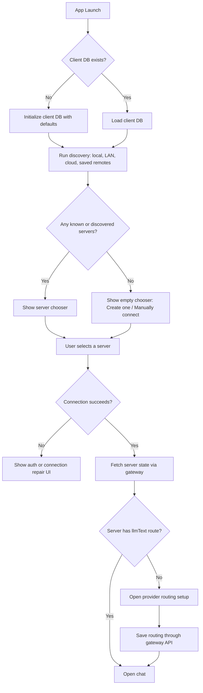
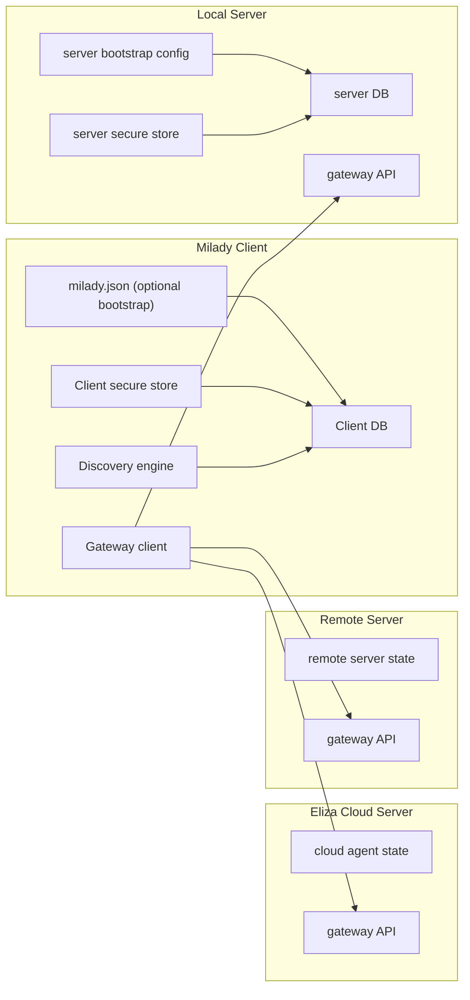

# Milady Client/Server Config and Discovery Design

## Goal

Make Milady behave like a client that can discover, create, and connect to agents consistently across local, LAN, remote, and Eliza Cloud.

The main correction is architectural:

- the app should not require a large handwritten config file to start
- the app should treat local, LAN, remote, and cloud as the same client concept: a reachable server
- mutable settings should live in a database
- bootstrap and advanced overrides should live in a small optional `milady.json`
- secrets should live in secure storage, not in the general settings store
- provider routing should be server-owned and changed through the gateway API

## Desired Product Behavior

### First Launch

If Milady starts and there is no hard-required config file, the user should see a chooser instead of a configuration wizard:

1. `LAN agent one: Ren`
2. `LAN agent two: Kei`
3. `Eliza Cloud agent: Bob`
4. `Create one`
5. `Manually connect to one`

Rules:

- Eliza Cloud entries are omitted when the client has no cloud credentials.
- `Create one` means create or start a local Milady-compatible server.
- `Manually connect to one` means enter IP/URL/token and connect to a compatible server.
- Mobile follows the same model. It is a client, not a special-case runtime.

### Core Mental Model

- Milady app = client
- Local runner = server
- Remote host = server
- Eliza Cloud = server
- LAN discovery = one way to find servers
- Manual connect = one way to find servers
- Create local = one way to provision a server

The client should not care whether the selected server is local, cloud, or remote after connection succeeds.

## Source of Truth

The repo should stop treating one config object as if it owns everything.

### Correct Split

#### 1. Client bootstrap config

Optional file: `~/.milady/milady.json`

Purpose:

- bootstrap the Milady client
- point to the client database location
- hold advanced client-only defaults
- hold discovery and local-runner defaults
- optionally define auto-connect or auto-start behavior

This file should stay small and stable.

It should not be the primary store for mutable app settings.

#### 2. Client database

Primary mutable store for the Milady app.

Purpose:

- known servers
- active server selection
- cached discovery results
- onboarding progress
- UI preferences
- per-server connection metadata
- secret references
- recently used agents and sessions

This is the main source of truth for the app UI.

#### 3. Server bootstrap config

Each local server instance can have a small bootstrap config.

Purpose:

- database location
- bind host and port
- auth mode
- discovery advertisement options
- workspace path
- initial startup defaults

This config is for booting a server, not for the client to mutate during normal app use.

#### 4. Server database

Primary mutable store for each server.

Purpose:

- agent records
- provider routing
- linked accounts
- runtime state
- connector state
- conversation/session state
- deployment state
- voice/media/RPC routing

This is where server-owned live settings should persist.

#### 5. Secret store

Separate secure storage.

Purpose:

- API keys
- OAuth tokens
- local server auth secrets
- wallet secrets

The app and server should reference secrets by id, not by embedding them everywhere.

## One Main File

The desired answer is:

- yes, Milady should have one main client bootstrap file: `milady.json`
- no, that file should not be the only source of truth for the whole system

The right pattern is:

- one small main JSON bootstrap file
- database for mutable state
- secure store for secrets

This matches the conversation:

- database is good for settings read/write from the app
- config is good for bootstrap and one-time setup
- config can be optional if defaults work
- if the only setting were DB location, env var could be enough
- config becomes useful once multiple client bootstrap settings exist

## Gateway Ownership

All live server state changes should go through the gateway API.

The client should not directly author server runtime files once the server exists.

That means:

- onboarding should not directly persist live provider routing into local files
- settings UI should not patch raw config blobs
- cloud login should not directly imply cloud inference
- local, cloud, and remote should all expose the same server-facing settings contract

## Provider Routing

Provider routing must be server-owned.

A user should be able to:

- run a local server and use local llama
- run a local server and use OpenAI
- run a local server and use Eliza Cloud inference
- run a cloud server and use OpenAI
- run a cloud server and use local-style providers if that server supports them
- run a remote server and use any provider that server is configured for

The client selects a server.
The server selects providers.

The server should expose a canonical routing model through the gateway:

```ts
type DeploymentTarget = {
  runtime: "local" | "cloud" | "remote";
};

type LinkedAccounts = Record<string, {
  status?: "linked" | "unlinked";
  source?: "api-key" | "oauth" | "credentials" | "subscription";
}>;

type ServiceRouting = {
  llmText?: {
    backend?: string;
    transport?: "direct" | "cloud-proxy" | "remote";
    accountId?: string;
    primaryModel?: string;
  };
  tts?: { ... };
  media?: { ... };
  embeddings?: { ... };
  rpc?: { ... };
};
```

The app should read and write this only through the server API.

## Discovery Model

### Discovery sources

- local embedded runner
- mDNS / LAN discovery
- manually saved remote servers
- Eliza Cloud agents

### Discovery output

All discovered targets should normalize to the same server record shape:

```ts
type KnownServer = {
  id: string;
  kind: "local" | "lan" | "remote" | "cloud";
  label: string;
  baseUrl?: string;
  cloudAgentId?: string;
  authMode?: "none" | "token" | "password" | "oauth";
  lastSeenAt?: string;
  capabilities?: string[];
};
```

### Discovery rules

- Cloud entries only appear when cloud auth exists.
- LAN entries appear when discovered on the network.
- Saved remote entries appear even when offline, but indicate stale state.
- Local embedded entries appear if the app can start or detect a local server.

## First-Run UX Flow



## System Topology



## Configuration Boundaries

### Client `milady.json`

Should include only:

- client DB path
- optional default profile
- discovery defaults
- local embedded server defaults
- advanced debug or developer overrides

Should not include:

- mutable provider routing
- cloud inference selection
- remote server live state
- conversation state
- general UI settings

### Client DB

Should include:

- server records
- active server id
- last selected agent per server
- onboarding status
- provider setup completion flags
- cached capability snapshots
- local app settings

### Server bootstrap config

Should include:

- DB path
- bind host and port
- auth configuration
- discovery advertisement
- workspace root
- initial agent manifest pointers

### Server DB

Should include:

- linked accounts
- service routing
- deployment/runtime settings
- agent settings
- connector settings
- mutable runtime state

## Security Model

Local and remote servers need explicit auth boundaries.

Required:

- local server can require a password or token
- client stores only secret references or secure material in the secure store
- LAN discovery never implies trusted access
- selecting a discovered LAN server still goes through auth
- cloud and remote behave the same way from the client perspective: authenticated server connections

## What the Current Repo Still Gets Wrong

These are the core conflicts still visible in the codebase:

1. Client and server concerns are mixed.
   - onboarding and settings flows still write server-like state directly

2. Config and runtime concerns are mixed.
   - config migration and runtime routing are still tightly coupled

3. Provider selection and hosting target are mixed.
   - the repo still contains logic where local/cloud/remote affects provider routing too early

4. Discovery is not yet the primary boot path.
   - the current setup still leans on onboarding/config instead of chooser-first behavior

5. Secrets and settings are still partially mixed.
   - some credential paths still bypass the canonical state model

## Migration Plan

### Phase 1: Define the boundaries

- add a client state model with `KnownServer`
- define client DB ownership
- shrink `milady.json` scope to bootstrap only
- define a gateway-owned server settings contract

### Phase 2: Make the app boot as a client

- boot client DB with no required config file
- run discovery on startup
- show chooser-first UX
- make `Create one` start or provision a local server
- make `Manually connect` create a server record

### Phase 3: Move live settings behind the gateway

- provider routing becomes API-only
- onboarding no longer writes live routing directly
- settings screens call gateway endpoints for server-owned settings
- local, cloud, and remote use the same settings UI contract

### Phase 4: Simplify server bootstrap

- local runner uses small server bootstrap config
- DB path, bind, auth, discovery defaults move there
- mutable settings leave bootstrap config entirely

### Phase 5: Remove legacy config coupling

- stop reading provider and cloud routing from legacy config paths
- stop using config as general mutable settings storage
- keep migration only for legacy import and compatibility

## Acceptance Criteria

- Milady launches without requiring a handwritten config file.
- First launch shows discover/connect/create instead of provider/config questions.
- Cloud entries are hidden when no cloud credentials exist.
- The client can manage multiple servers.
- Local, LAN, remote, and cloud all use the same connection model.
- Provider routing is always server-owned.
- Mutable settings no longer depend on direct config writes from the app.
- Secrets are not stored in the general app settings store.

## Implementation Notes

This design implies that `milady.json` remains desirable, but only as a small optional bootstrap file.

The database becomes the main mutable store for the client.

The gateway becomes the only supported write path for live server settings.

That is the direction that best matches both the conversation and the long-term behavior Milady needs.
